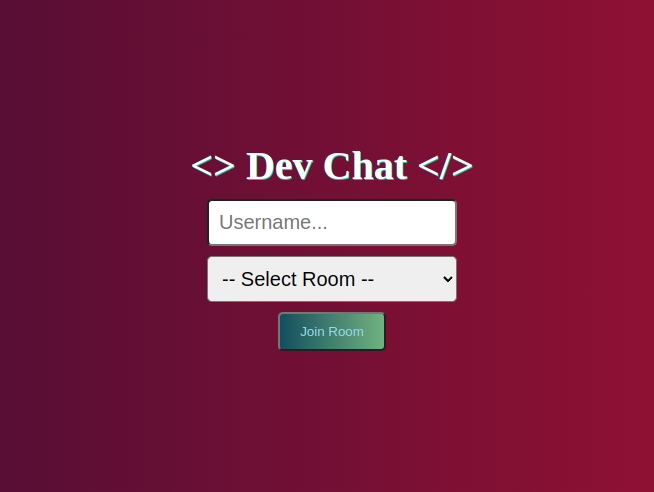
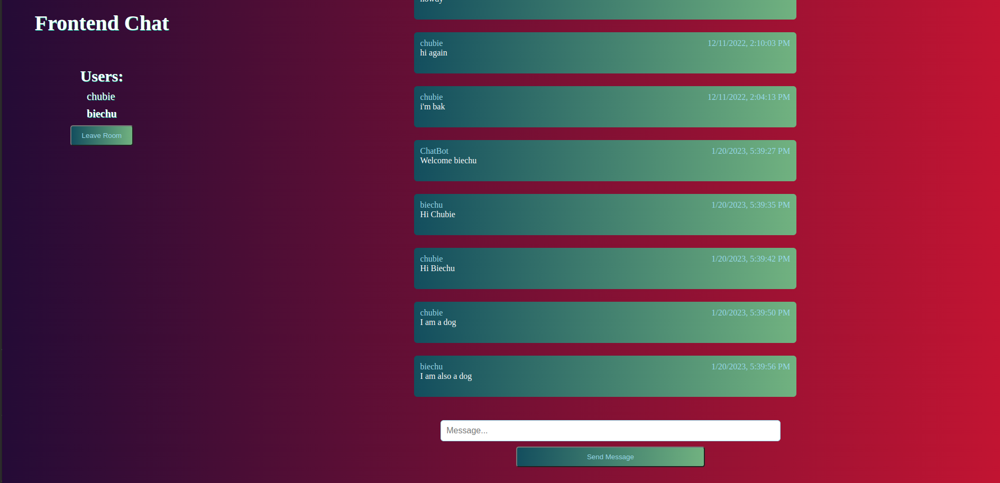

This is a realtime chatroom app made with the MERN stack.

I wanted to see how to use socket.io. It's pretty cool.

I used typescript with the node server.

On the homescreen you have a simple form. You add your username & using the
dropdown, select the chatroom, & Join Room

After you Join Room you are in the chat. Using Socket.io multiple users can 
be on at the same time. And chat updates are live (As you can see there is
a lively conversation happening in the chatroom).

The messages and timestamps are sent from the frontend via socket.io to the
backend. Where they are then saved to MongoDB.

Previous messages are received by the backend from MongoDB and sent to the
frontend via socket.io and displayed.

I've Dockerized the front & back ends and added Docker Compose so anyone can run the containers on their local machine.